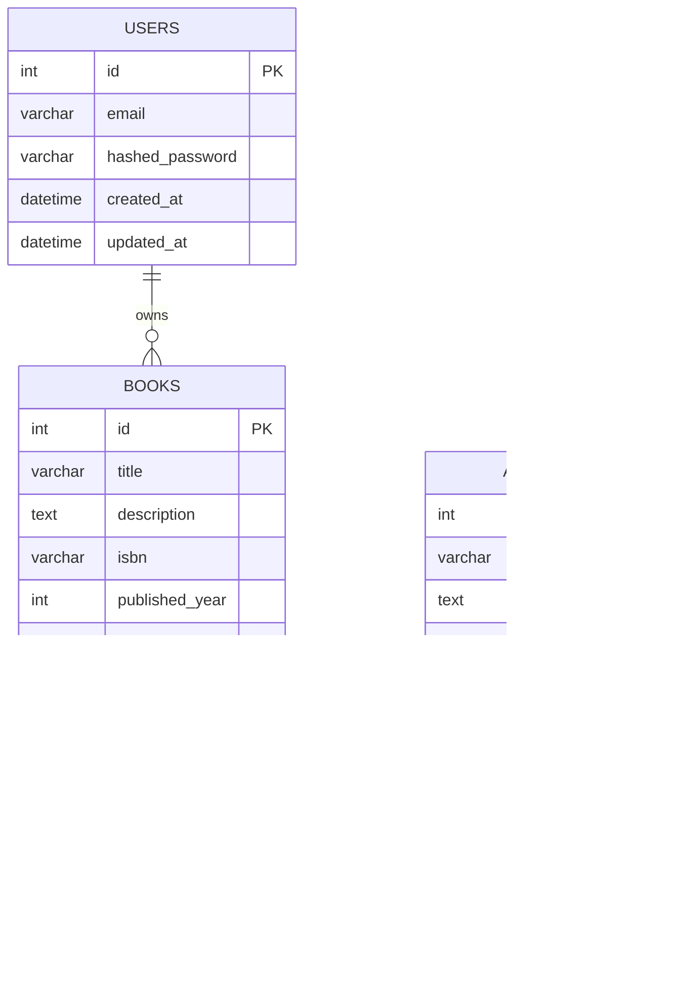

```mermaid
erDiagram
    USERS {
        int id PK
        varchar email
        varchar hashed_password
        datetime created_at
        datetime updated_at
    }

    AUTHORS {
        int id PK
        varchar name
        text biography
        datetime created_at
    }

    BOOKS {
        int id PK
        varchar title
        text description
        varchar isbn
        int published_year
        int owner_id FK
        datetime created_at
        datetime updated_at
    }

    BOOK_AUTHOR {
        int book_id FK
        int author_id FK
    }

    USERS ||--o{ BOOKS : owns
    BOOKS ||--o{ BOOK_AUTHOR : has
    AUTHORS ||--o{ BOOK_AUTHOR : writes
```
